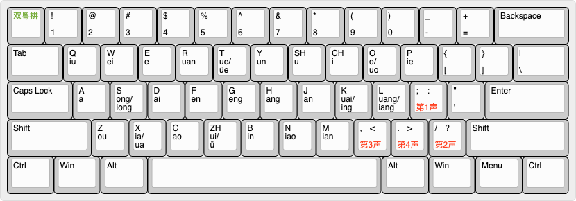

# rime-td-pinyin-flypy-display

## About

This is a layout for typing in Shuangpin (双拼) with the Flypy (小鹤双拼) layout. Will display pronunciations in Cantonese as you type in Mandarin. You can also start typing in Cantonese via [Double Jyutping](https://github.com/gkovacs/rime-double-jyutping-extra/blob/master/README.md) by entering \` and it will display Mandarin pronunciations.

## Flypy Double Pinyin with Optional Tones (小鹤双拼)



This is identical to the standard Flypy Double Pinyin 小鹤双拼 and adds the ability to optionally add tones.

All syllables in Standard Chinese (Mandarin / Putonghua / 普通话) can be entered unambiguously with 2 keystrokes.

You can optionally enter a tone with 1 additional keystroke - 1 is `;`, 2 is `/`, 3 is `,`, 4 is `.`. For instance, 师 is `ui;` 时 is `ui/` 使 is `ui,` 是 is `ui.`

You can type "\`" to temporarily switch to Cantonese lookup mode, if you don't know the Putonghua pronunciation for a word. In this mode you can enter words using the [Double Jyutping](https://github.com/gkovacs/rime-double-jyutping-extra/blob/master/README.md) method, and it will display the Pinyin next to the Chinese characters.

## Installing

First ensure you have plum installed. For macOS this would be:

```bash
cd ~/Library/Rime
wget https://git.io/rime-install
```

Then install `gkovacs/rime-td-pinyin-flypy-extra` using plum:

```bash
bash rime-install gkovacs/rime-double-jyutping gkovacs/rime-td-pinyin-flypy gkovacs/rime-double-jyutping-display gkovacs/rime-td-pinyin-flypy-display gkovacs/rime-terra-pinyin-tradsimp gkovacs/rime-jyutping-tradsimp gkovacs/rime-cangjie-tradsimp gkovacs/rime-td-pinyin-flypy-extra
```

Finally edit `default.custom.yaml` and add `td_pinyin_flypy_extra` to the schema list:

```bash
patch:
  schema_list:
    - schema: td_pinyin_flypy_extra
```

Now reload RIME and it should appear under your layouts.

You can also lookup via Cangjie by entering the first letter as capital (e.g. 明 = 日月 = Ab).

You can also lookup in other languages by pressing "op" (Japanese) "ok" (Korean) "ov" (Vietnamese) "os" (Stroke) "oi" (European languages) but you will have to install the following packages:

```bash
bash rime-install stroke gkovacs/rime-japanese gkovacs/rime-korean gkovacs/rime-vietnamese gkovacs/rime-cangjie-tradsimp gkovacs/rime-spanish
```
